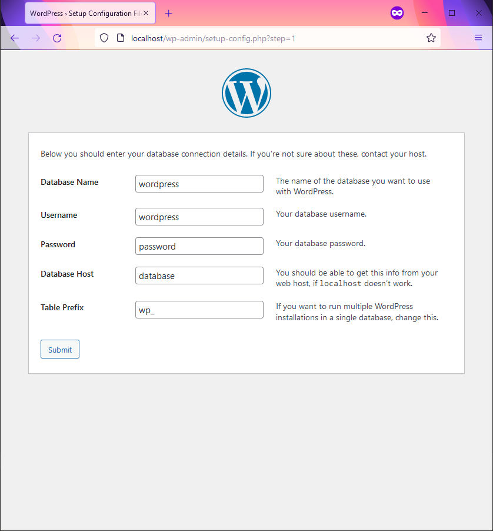

# WordPress Docker Wrapper

Just enough code to run a copy of WordPress with Docker.

## How to use

### Step 1: Prepare the .env file

Copy the `.env.example` file and save it as `.env`.

```console
user@pc:~/wordpress-docker-wrapper$ cp .env.example .env
```

Get your user's `UID`

```console
user@pc:~/wordpress-docker-wrapper$ id -u
1000
```

and your user's `GID`

```console
user@pc:~/wordpress-docker-wrapper$ id -g
1000
```

and put them into the `.env` file

```shell
# Container user
UID=1000
GID=1000
```

Feel free to change the default database credentials in the `.env` file if you want.
Just make sure you do this _before_ the Docker containers are built.

## Step 2: Download WordPress

Using `curl` we can download and extract WordPress inside the `src/` folder.

```console
user@pc:~/wordpress-docker-wrapper$ cd src/
user@pc:~/wordpress-docker-wrapper/src$ curl https://wordpress.org/latest.tar.gz | tar xvz --strip-components=1
```

Alternatively, we could use `wget` 

```console
user@pc:~/wordpress-docker-wrapper$ cd src/
user@pc:~/wordpress-docker-wrapper/src$ wget -qO- https://wordpress.org/latest.tar.gz | tar xvz --strip-components=1
```

If you decide to download WordPress manually instead of using the commands above, just make sure your `index.php` file
can be found at `src/index.php`

## Step 3: Start the Docker containers

If you already have services running on port `80` or `3306`, feel free to change the port mappings in the
`docker-compose.yaml` file before running the following command.

```console
user@pc:~/wordpress-docker-wrapper$ docker-compose up -d
```

You should now have two containers running. One with PHP and Apache, and the other with MariaDB.

```console
user@pc:~/wordpress-docker-wrapper$ docker ps
CONTAINER   IMAGE                COMMAND        CREATED        STATUS        PORTS                    NAMES
f862efb26   wordpress_server     "docker-ph…"   1 second ago   Up 1 second   0.0.0.0:80->80/tcp       wordpress_server_1
eb2f49043   wordpress_database   "docker-en…"   1 second ago   Up 1 second   0.0.0.0:3306->3306/tcp   wordpress_database_1
```

Step 4: Install WordPress

You should be able to access WordPress via `http://localhost` in your web browser.


When you reach the database configuration page, you can use "database" as the host. This is because Docker has an
internal DNS and knows that "database" represents one of the services found in the `docker-compose.yaml` file and will
connect you to the `wordpress_database_1` container.



Finally, you can log in and check the WordPress Site Health tool to ensure all the PHP requirements are met.


