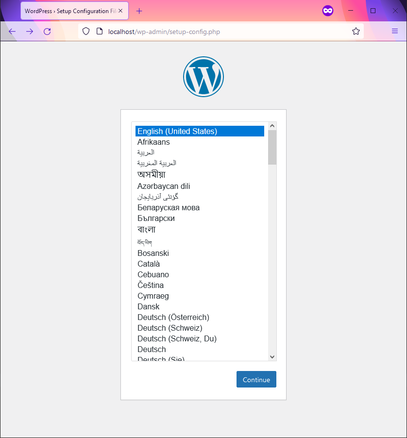

<h1 align="center">WordPress Docker Wrapper</h1>

<p align="center">Just enough code to run a copy of WordPress with Docker.</p>

<p align="center"></p>

## Instructions

### Step 1: Download the WordPress Docker Wrapper

Click the
[](https://github.com/benabbottnz/wordpress-docker-wrapper/generate)
button so that you have your own copy on GitHub. You could call it `username/my-website` if you wanted.

Now you can download your `my-website` project to your computer and continue with the steps below.

### Step 2: Prepare the .env file

Copy the `.env.example` file and save it as `.env`

```console
user@pc:~/my-website$ cp .env.example .env
```

To ensure the container running WordPress uses the correct file permissions, get your user's `UID` and `GID` as follows:

```console
user@pc:~/my-website$ id -u
1000
user@pc:~/my-website$ id -g
1000
```

and put them into the `.env` file:

```shell
# Server container settings
UID=1000
GID=1000
```

Feel free to change the default database credentials in the `.env` file if you want.
Just make sure you do this _before_ the Docker containers are built.

### Step 3: Download WordPress

Using `curl` we can download and extract WordPress inside the `src/` folder.

```console
user@pc:~/my-website$ cd src/
user@pc:~/my-website/src$ curl https://wordpress.org/latest.tar.gz | tar xvz --strip-components=1
```

Alternatively, we could use `wget` 

```console
user@pc:~/my-website$ cd src/
user@pc:~/my-website/src$ wget -qO- https://wordpress.org/latest.tar.gz | tar xvz --strip-components=1
```

If you decide to download WordPress manually instead of using the commands above, just make sure your `index.php` file
can be found at `src/index.php`

### Step 4: Start the Docker containers

If you already have services running on port `80` or `3306`, feel free to change the port mappings in the
`docker-compose.yaml` file before running the following command.

```console
user@pc:~/my-website$ docker-compose up -d
```

You should now have two containers running. One with PHP and Apache, and the other with MariaDB.

```console
user@pc:~/my-website$ docker ps
CONTAINER   IMAGE                CREATED        PORTS                    NAMES
f862efb26   my-website_server     1 second ago   0.0.0.0:80->80/tcp       my-website_server_1
eb2f49043   my-website_database   1 second ago   0.0.0.0:3306->3306/tcp   my-website_database_1
```

### Step 5: Install WordPress

You should be able to access WordPress via `http://localhost` in your web browser.



When you reach the database configuration page, you can use "database" as the host. This is because Docker has an
internal DNS and knows that "database" represents one of the services found in the `docker-compose.yaml` file and will
connect you to the `my-website_database_1` container.


Finally, you can log in and check the WordPress Site Health tool to ensure all the PHP requirements are met.


